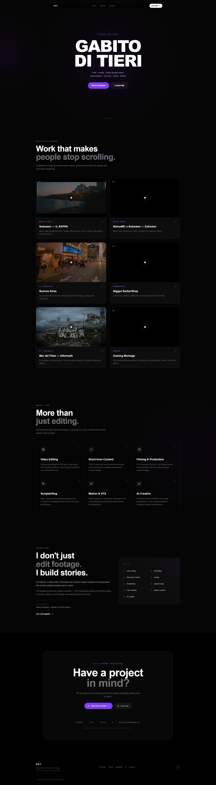
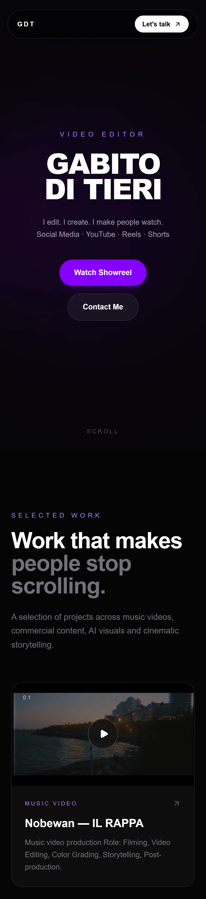

GDT — Video Editor · Filmmaker · Creator

Portfolio audiovisual profesional desarrollado con Next.js, React, TypeScript y Tailwind CSS.

🌐 Live: https://gabitomedia.vercel.app/

📦 Repository: https://github.com/Gabitomedia/gabitoweb

📸 Preview

Desktop

Mobile

---

## 🎬 About the project

GDT is a personal portfolio website created to showcase professional work in:

- Video editing
- Filmmaking
- Content creation
- Commercial video
- Music videos
- AI-generated video projects

The website was designed and developed from scratch with a modern, cinematic and minimal visual identity.

The project combines audiovisual content with a responsive web interface, smooth animations and optimized external video delivery.

---

## ✨ Features

- Responsive design for desktop, tablet and mobile
- Cinematic hero section with showreel
- Interactive project showcase
- Video playback inside project cards
- Smooth UI animations and transitions
- Services section
- About section
- Contact section
- Social media links
- Responsive navigation
- Optimized image assets
- External video hosting through Cloudinary
- Automatic production deployments through Vercel
- Git-based development workflow

---

## 🛠️ Tech Stack

### Frontend

- **Next.js 16**
- **React**
- **TypeScript**
- **Tailwind CSS**

### UI & Animation

- **Framer Motion**
- **Lucide React**

### Media

- **Cloudinary** — video hosting and delivery

### Development & Deployment

- **Git**
- **GitHub**
- **Vercel**

---

## 🏗️ Architecture

The project follows a component-based architecture using the Next.js App Router.

### Application structure

- `app/` — Next.js App Router
- `app/layout.tsx` — Root layout and metadata
- `app/page.tsx` — Main portfolio page
- `app/globals.css` — Global styles
- `components/` — Reusable React components
- `public/images/` — Optimized image assets
- `public/videos/` — Local video directory excluded from Git
- `package.json` — Dependencies and project scripts
- `next.config.ts` — Next.js configuration
- `tsconfig.json` — TypeScript configuration
- `.gitignore` — Git exclusions

### Components

- `Navbar.tsx` — Navigation and responsive menu
- `Hero.tsx` — Hero section and showreel
- `Projects.tsx` — Portfolio projects and video players
- `Services.tsx` — Services section
- `About.tsx` — Personal and professional information
- `Contact.tsx` — Contact information and social links
- `Footer.tsx` — Footer and social links

The component-based structure keeps the application organized, maintainable and easy to extend.

---

## 🎥 Video Architecture

Large video files are not stored in the Git repository.

Portfolio videos are hosted through Cloudinary and loaded using their delivery URLs.

The media architecture is:

**User → Vercel → Next.js → Cloudinary CDN → Video**

This approach keeps the Git repository lightweight while allowing the portfolio to serve large audiovisual files externally.

The local `public/videos/` directory is excluded from Git using `.gitignore`.

---

## 🎨 Design

The visual direction combines:

- Dark interface
- High-contrast typography
- Violet accents
- Large cinematic media
- Minimal UI
- Rounded cards
- Glass / translucent surfaces
- Smooth motion
- Responsive layouts

The goal was to keep the interface visually focused on the audiovisual work rather than competing with it.

---

## 📱 Responsive Design

The website was designed to adapt to different screen sizes.

The interface has dedicated responsive behavior for desktop, tablet and mobile layouts.

Navigation, typography, project cards, video players and spacing adapt according to the available screen size.

---

## 🚀 Getting Started

### Requirements

You need:

- Node.js
- npm
- Git

### Clone the repository

Run `git clone https://github.com/Gabitomedia/gabitoweb.git`

Then enter the project directory with `cd gabitoweb`.

### Install dependencies

Run `npm install`.

### Development server

Run `npm run dev`.

The development server will be available at `http://localhost:3000`.

---

## 🏭 Production Build

To create a production build, run `npm run build`.

To run the production version locally, use `npm run start`.

---

## ☁️ Deployment

The project is deployed using Vercel.

The deployment workflow is:

**GitHub → git push → Vercel → automatic build → production deployment**

Every push to the `main` branch can trigger a new production deployment.

🌐 **Production:** https://gabitomedia.vercel.app/

---

## 🔄 Development Workflow

The project uses Git and GitHub for version control.

The typical workflow is:

**Edit → `git add` → `git commit` → `git push` → Vercel deployment**

This allows changes to the project to be versioned and automatically deployed.

---

## 📂 Media Strategy

Large audiovisual files are intentionally kept outside GitHub.

### Stored in the repository

- Source code
- React components
- Styles
- Configuration
- Optimized image thumbnails
- SVG assets

### Hosted externally

- Showreel
- Music videos
- Commercial projects
- AI video projects
- Gaming projects

Cloudinary is used for external video delivery, keeping the Git repository lightweight.

---

## 🔗 Links

**Portfolio:** https://gabitomedia.vercel.app/

**GitHub:** https://github.com/Gabitomedia/gabitoweb

---

## 👤 Author

**Gabito / GDT**

Video Editor · Filmmaker · Creator

Portfolio: https://gabitomedia.vercel.app/

---

## 📄 License

This repository contains personal portfolio work and is intended primarily for demonstration and professional presentation.

Please do not reuse the audiovisual content or personal branding without permission.
